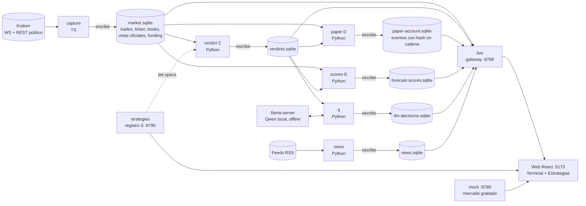
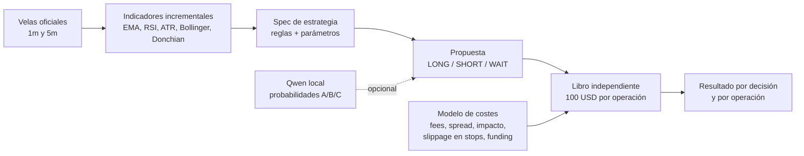
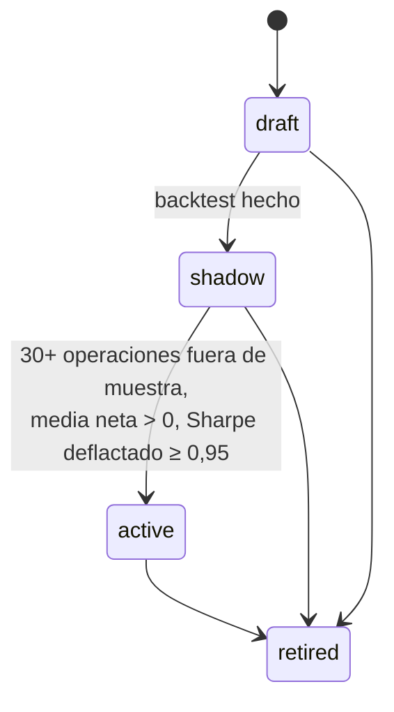
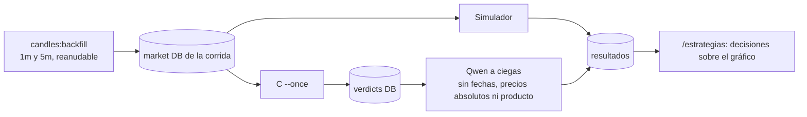

# Balancita

Espacio de trading personal, local y **solo futuros perpetuos de Kraken (`PF_*`)**. Captura mercado público en vivo, decide con estrategias declarativas (y opcionalmente un Qwen local), simula cada estrategia en su propio libro **paper** y lo muestra en una terminal y en un laboratorio de estrategias.

> **Sin dinero real**: no hay órdenes reales, endpoints privados ni credenciales ([ADR 0001](docs/adr/0001-isolated-paper-futures-accounting.md)). Los datos de Kraken se usan solo en local y no se redistribuyen.

## Qué hace

| Pantalla        | Ruta             | Para qué sirve                                                                                                                        |
| --------------- | ---------------- | ------------------------------------------------------------------------------------------------------------------------------------- |
| **Terminal**    | `/`, `/terminal` | Gráfico de velas por producto, decisiones del motor, entradas, stops y objetivos por estrategia, cuenta paper y salud por proceso.    |
| **Estrategias** | `/estrategias`   | Laboratorio: ver y editar reglas, ranking por rentabilidad (7/30/90 d), backtests, replays sobre un rango y Qwen decidiendo a ciegas. |

- **Fuente de datos**: interruptor _MOCK_ / _Real (paper, Kraken público)_ (`?source=mock|live`, se recuerda en local). Si el backend elegido no responde, la página lo dice; nunca cae a la otra fuente.
- **Productos**: los 8 de [`config/futures-products.json`](config/futures-products.json) (`PF_XBTUSD`, `PF_ETHUSD`, `PF_SOLUSD`, `PF_ZECUSD`, `PF_XRPUSD`, `PF_NEARUSD`, `PF_HYPEUSD`, `PF_ADAUSD`), fijados en el archivo para que los replays sean deterministas.
- **Estrategias**: C25 pullback en tendencia, C26 reversión en rango, C27 ruptura Donchian, C28 adaptador por régimen, y C29 y C30 momentum logarítmico lento ([`config/strategies/`](config/strategies)). Cada una opera **su propio libro**, largo o corto, con **100 USD fijos por operación**. Su fiabilidad medida con costes (C25-C28 pierden en los 8 productos; C29 y C30 no tienen ventaja demostrada) está en [`docs/strategy-reliability.md`](docs/strategy-reliability.md).

## Arquitectura

Cada proceso tiene **un único escritor** por archivo SQLite, las tablas son _append-only_ y el replay es determinista (la corrida en vivo y `--once` dan lo mismo).



### Procesos de `pnpm dev`

| Proceso      | Puerto | Qué es                                                                                                                                                                    |
| ------------ | ------ | ------------------------------------------------------------------------------------------------------------------------------------------------------------------------- |
| `vite`       | 5173   | App web y proxy (`/api-mock` → 8788, `/api-live` → 8789, `/api-strategies` → 8790)                                                                                        |
| `mock`       | 8788   | Fuente MOCK: mercado BTC determinista de 12 h, con C y D reales corriendo `--once` sobre él (sin comandos paper)                                                          |
| `capture`    | -      | WebSocket y REST públicos de Kraken → `server/data/dev-live/futures-market.sqlite` (único escritor)                                                                       |
| `live`       | 8789   | Gateway de solo lectura: sirve `/api/terminal/*` leyendo el market DB; no arranca recolector ni motor                                                                     |
| `verdict`    | -      | **C**: lee el market DB y escribe veredictos de entrada (`futures-verdicts.sqlite`)                                                                                       |
| `paper`      | -      | **D**: un libro por estrategia y producto; fills con el ticker real; eventos con hash en cadena (`futures-paper-account.sqlite`)                                          |
| `scores`     | -      | **E**: puntúa cada propuesta contra las velas oficiales posteriores (`futures-forecast-scores.sqlite`)                                                                    |
| `forward`    | -      | Libro de paper hacia delante de las estrategias de `config/forward-strategies.json` (C30), cada 30 min (`server/data/dev-live/forward/`); Q y el registro leen su resumen |
| `strategies` | 8790   | Registro de estrategias **S**: validar, evaluar, backtest, versiones y ciclo de vida                                                                                      |
| `news`       | -      | **N**: RSS/Atom → `futures-news.sqlite`; con Qwen, relevancia y dirección por noticia                                                                                     |
| `llm` / `q`  | 8088   | `llama-server` local y servicio de decisiones **Q** (opcionales, nunca bloquean el arranque)                                                                              |
| `qwenexit`   | -      | **C31**: entradas de C25/C26/C27/C30 y salida decidida solo por Qwen, cada 30 min (`server/data/dev-live/qwen-exit/`); necesita el modelo local, ver `docs/qwen-exit.md`    |

Un proceso opcional que cae se reinicia con _backoff_ (1 s hasta 30 s; se rinde tras 8 fallos rápidos o `EADDRINUSE`) y su estado se ve como chip en la Terminal.

## Cómo decide y simula



- **Un solo simulador** (`futures_simulator.py`): el mismo para el paper en vivo, el backtest, los scores y Qwen, así una estrategia reporta los mismos números en todas partes.
- **Un solo modelo de costes** (`futures_costs.py`): comisión taker/maker real (0,05 % / 0,02 %), spread e impacto por producto, slippage en stops y funding real. El round-trip de BTC pasó de 7 a ~10 bp.
- **Un solo criterio de acierto**: por operación (P&L neto > 0 tras costes) y por decisión (dirección correcta al horizonte de la propia estrategia).
- **Specs declarativas** (`balancita-strategy.v1`): el Laboratorio permite añadir y quitar condiciones, cambiar parámetros y periodos de indicadores, crear variantes y traducir código Pine/Freqtrade con el Qwen local (se revisa antes de guardar; el código nunca se ejecuta).

Ciclo de vida de una estrategia en el registro:



El backtest usa el primer 70 % del periodo como _in-sample_ y el resto como _out-of-sample_; cada spec distinta probada cuenta como un intento (_trial_) para el Sharpe deflactado.

## Replays y Qwen a ciegas

Se puede reproducir un producto y un rango de fechas elegidos y medir el acierto de Qwen sin esperar velas nuevas:



Cada corrida escribe sus propias bases y nunca toca las de en vivo. Las respuestas de Qwen se cachean por _hash_ del estado (temperatura 0). Un Qwen puede reconocer un episodio por la forma numérica: las decisiones sobre datos pasados no prueban habilidad; júzgalas con datos posteriores a su fecha de corte.

## Requisitos

- **Node.js** `^20.19.0 || >=22.12.0` (el servidor pide `>=22.12`).
- **pnpm** ≥ 9.
- **Python 3.9+** con `sqlite3` enlazado a SQLite ≥ 3.37 (tablas `STRICT`), solo biblioteca estándar. `dev` busca `BALANCITA_PYTHON`, luego `python3`, `python` (y `py -3` en Windows). Sin Python válido arrancan `vite`, `mock`, `capture` y `live`; la Terminal muestra el motor como no disponible.
- Opcional: `llama-server` (`brew install llama.cpp`) y un GGUF de Qwen3.5-4B o Qwen3-4B para `llm` y `q`.

## Puesta en marcha

```bash
pnpm install
pnpm dev          # abre http://localhost:5173
```

`pnpm dev` comprueba los puertos 5173, 8788, 8789 y 8790 antes de arrancar; si uno está ocupado dice cuál y sale con código 1 (`lsof -ti tcp:<puerto> | xargs kill`). Cada proceso tiene su log con prefijo, Ctrl+C detiene todo el grupo y los restos de un `dev` anterior en este checkout se limpian solos. El estado de cada proceso se escribe en `server/data/dev-live/dev-health.json`.

Sin red, `capture` y la fuente Real avisan; `vite`, `mock` y el resto siguen funcionando, así que MOCK siempre es utilizable.

### Configuración (`.env.local` o `.env` en la raíz; el entorno real gana)

| Variable               | Por defecto   | Significado                                                 |
| ---------------------- | ------------- | ----------------------------------------------------------- |
| `BALANCITA_PYTHON`     | autodetectado | Ejecutable de Python (sin _fallback_ si falla)              |
| `DECISIONS_ENABLED`    | activo        | `0` desactiva `llm` y `q`                                   |
| `LLAMA_MODEL_PATH`     | -             | GGUF local; si falta se busca Qwen en las cachés habituales |
| `LLAMA_HF`             | -             | Referencia Hugging Face explícita (siempre `--offline`)     |
| `LLAMA_PORT`           | `8088`        | Puerto loopback                                             |
| `LLAMA_CTX`            | `8192`        | Contexto                                                    |
| `LLAMA_PARALLEL`       | `2`           | Slots paralelos                                             |
| `DECISIONS_PRODUCTS`   | `PF_XBTUSD`   | Productos que decide Q (separados por comas)                |
| `NEWS_ENABLED`         | activo        | `0` desactiva `news`                                        |
| `NEWS_EXTRA_RSS_FEEDS` | -             | Feeds extra `id\|label\|https url\|license`                 |

**El modelo corre 100 % offline**: `dev` nunca descarga nada, `llama-server` va con `--offline` en `127.0.0.1` y Q rechaza cualquier URL que no sea loopback. Las noticias nunca se envían a una API remota.

## Datos y utilidades

```bash
# Histórico de velas oficiales 1m/5m de todos los productos (reanudable)
pnpm --dir server candles:backfill --days 90 [--db ruta] [--products PF_XBTUSD,...]

# Retención: borra eventos crudos (trades, tickers, books) de más de N días; las velas se conservan
pnpm --dir server market:prune --days 7     # con capture parado

# Replay de estrategias sobre un rango
PYTHONPATH=python python3 -m balancita_engine.futures_replay --help

# Prueba de Q con llama-server levantado
PYTHONPATH=python python3 -m balancita_engine.futures_llm_decisions --probe

# Agregados de los forecast scores
PYTHONPATH=python python3 -m balancita_engine.futures_forecast_scores --scores-db <db> --report
```

Las preguntas de Q y sus _prompts_ son datos versionados (`config/decision-questions.json`, `config/decision-prompts.json`, `config/decision-calibration.json`): cambiar el texto de una pregunta exige subir su `version`.

## Scripts y pruebas

| Comando                                                                       | Qué hace                                            |
| ----------------------------------------------------------------------------- | --------------------------------------------------- |
| `pnpm dev`                                                                    | Arranca todos los procesos                          |
| `pnpm test` / `pnpm test:watch`                                               | Vitest del front (jsdom + Testing Library)          |
| `pnpm test:server` / `pnpm typecheck:server`                                  | Pruebas y tipos del servidor                        |
| `pnpm typecheck`, `pnpm lint`, `pnpm format`, `pnpm format:check`             | Tipos, ESLint y Prettier                            |
| `pnpm build` / `pnpm preview`                                                 | Build de producción y vista previa                  |
| `pnpm test:e2e`                                                               | Playwright (capturas por ruta a 1440×900 y 390×844) |
| `PYTHONPATH=python:python/tests python3 -m unittest discover -s python/tests` | Pruebas de Python                                   |
| `node --test scripts/*.node-test.mjs`                                         | Pruebas de los scripts de `dev`                     |

## Estructura

```text
src/                 Front React: app/ (Terminal), features/strategy-lab, trading-view, shared/
server/src/          app/ (capture, gateway, mock), features/ (kraken-futures, live-gateway, paper-futures, news), platform/
python/balancita_engine/   C, D, E, Q, N, S, simulador, costes, indicadores, replay
config/              Productos, estrategias C25-C30 y su fiabilidad medida, preguntas y prompts de Q, fuentes de noticias
docs/                Contratos de APIs, ADR 0001, roadmap
odd/tasks/           Planes de trabajo (strategy-simulation.md es el vigente)
doc/                 Guías y especificaciones de producto
```

Documentación relacionada: [registro de estrategias](docs/strategy-registry-api.md) · [fiabilidad de las estrategias](docs/strategy-reliability.md) · [datos de mercado de Kraken Futures](docs/kraken-futures-market-data.md) · [aprendizaje de Qwen](docs/qwen-lessons.md) · [scores de Qwen](docs/qwen-scores-api.md) · [plan de simulación](odd/tasks/strategy-simulation.md) · [`doc/personal-trading-app.md`](doc/personal-trading-app.md) (hoja de ruta; no se edita con herramientas).

## Atribución del gráfico

Las velas se dibujan con [Lightweight Charts] de TradingView (Apache License 2.0), que exige atribución; el logo aparece en la esquina por defecto (`layout.attributionLogo`).

[Lightweight Charts]: https://www.tradingview.com/lightweight-charts/
