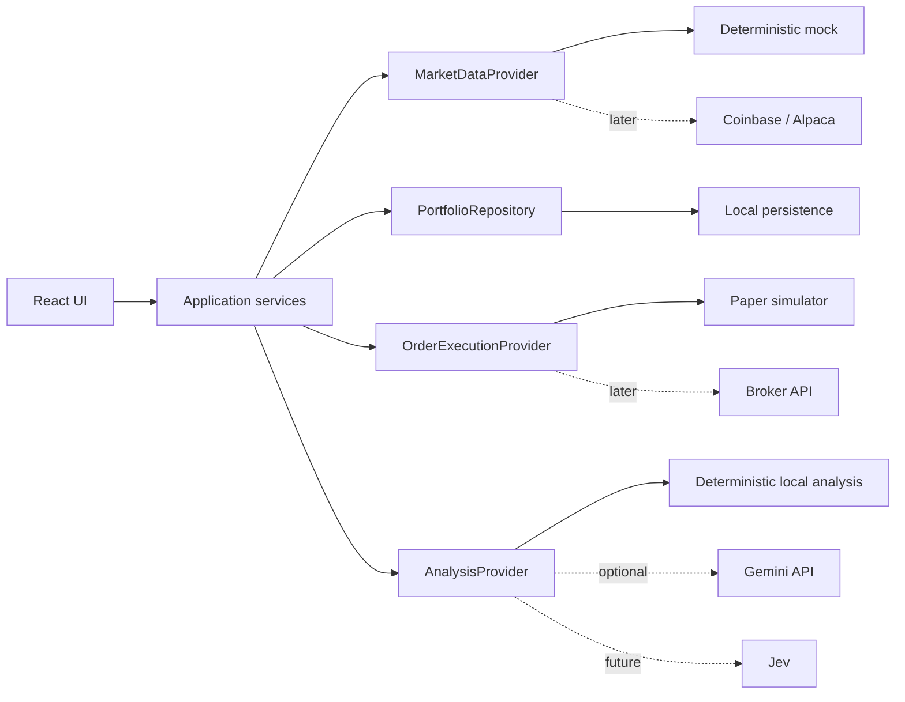

---
tags:
  - proyecto/personal
  - trading
  - frontend/react
  - frontend/typescript
  - ai/gemini
created: 2026-09-19
updated: 2026-09-19
status: idea
---

# Personal Trading App: fuente de verdad y prompts

> [!abstract] Decisión actual
> Construir una aplicación de trading de uso personal, local-first y con costo fijo inicial de **USD 0**. La primera versión usa datos mock deterministas y no se conecta a brokers, mercados ni Gemini. Cada integración externa se incorpora después, detrás de una interfaz y con una prueba explícita de valor.

Este documento define el producto, sus límites, la arquitectura evolutiva y los prompts que guían cada incremento. Si el código, una conversación o una propuesta contradicen este archivo, se debe detener el trabajo y actualizar primero la decisión correspondiente.

## Estado rápido

| Tema | Estado |
|------|--------|
| Repositorio de implementación | Pendiente; este repositorio no es el destino de la aplicación |
| Producto | Definido a nivel conceptual |
| Datos | Mock, locales y deterministas |
| Trading | Fuera del MVP inicial |
| Gemini | Opcional y desactivado por defecto |
| Jev | Diferido hasta validar el producto |
| Costo fijo objetivo | USD 0 durante el desarrollo local |
| Fase activa | Fase 0: preparar el proyecto |

## Visión

Una herramienta personal para observar instrumentos, entender la evolución de una cartera y ensayar decisiones sin mover dinero real. Debe comenzar como una aplicación local con datos simulados y evolucionar, mediante límites claros, hacia datos de mercado, paper trading y eventualmente órdenes reales.

### Instrumentos iniciales

| Identificador visible | Clase esperada | Moneda | Estado de verificación |
|-----------------------|----------------|--------|------------------------|
| `BTC-EUR` | Cripto | EUR | Producto disponible en Coinbase; confirmar al integrar |
| `TTWO` | Acción estadounidense | USD | Confirmar proveedor y permisos al integrar |
| `SPCX` | Pendiente de confirmar | Pendiente | No asumir bolsa ni activo sólo por el ticker |

Un ticker no es una identidad suficiente. Antes de consumir datos reales, cada instrumento debe tener `symbol`, nombre, clase, moneda, bolsa/MIC y símbolo específico del proveedor.

## Objetivos

1. Visualizar una watchlist y precios simulados que cambien en tiempo real.
2. Consultar detalle, velas y variación de cada instrumento.
3. Registrar una cartera personal y calcular su valoración con datos mock.
4. Crear alertas locales.
5. Simular órdenes y posiciones sin conectarse a un broker.
6. Incorporar análisis asistido por IA sin permitir que la IA ejecute órdenes.
7. Reemplazar proveedores mock por adaptadores reales de forma gradual.

## Fuera de alcance inicial

- Dinero real, depósitos, retiros o custodia.
- Ejecución automática de órdenes.
- Recomendaciones personalizadas de compra o venta.
- Usuarios múltiples, autenticación o permisos.
- Aplicación móvil nativa.
- Despliegue permanente en la nube.
- Microservicios, colas, Redis, Kubernetes o infraestructura distribuida.
- Backtesting cuantitativo avanzado.

## Principios no negociables

1. **Local-first:** la aplicación completa debe funcionar sin Internet mientras use mocks.
2. **Costo explícito:** ninguna fase habilita facturación o un servicio pago sin aprobación humana.
3. **Mock antes que API:** primero se valida la experiencia; después se compra o integra información.
4. **Una fase por vez:** no adelantar trabajo de fases futuras.
5. **TDD estricto:** observar RED, implementar lo mínimo para GREEN y refactorizar sin alterar el comportamiento.
6. **Datos deterministas:** los tests no dependen del reloj real, aleatoriedad no controlada ni Internet.
7. **IA consultiva:** Gemini, un modelo local o Jev pueden explicar y clasificar; nunca autorizan ni envían órdenes.
8. **Secretos sólo en servidor:** ninguna clave se incluye en frontend, logs, fixtures, commits o prompts.
9. **Degradación segura:** si una integración falla o agota su cuota, la aplicación continúa con mocks o informa el estado sin romperse.
10. **Sin automatización financiera implícita:** cada paso hacia trading real requiere una decisión y una fase independiente.

## Arquitectura evolutiva



### Stack objetivo

| Capa | Decisión | Motivo |
|------|----------|--------|
| Lenguaje | TypeScript estricto | Tipos compartidos y un solo lenguaje inicial |
| UI | React + Vite | Desarrollo local simple y rápido |
| Estilos | CSS Modules o CSS del proyecto | Evitar incorporar un design system antes de necesitarlo |
| Gráficos | Lightweight Charts | Gráficos financieros livianos; requiere atribución a TradingView |
| Tests | Vitest + Testing Library + user-event | Pruebas de dominio y comportamiento visible |
| E2E | Playwright, cuando exista un flujo completo | Validación del recorrido principal |
| Persistencia inicial | `localStorage` con repositorio intercambiable | Cero infraestructura para datos personales pequeños |
| Persistencia posterior | SQLite | Cuando se agregue servidor, auditoría o mayor volumen |
| Backend posterior | Fastify | Proteger secretos e integrar APIs sin exponerlas al navegador |
| Gestor de paquetes | pnpm | Instalación reproducible y eficiente |

No crear el backend hasta que una integración requiera secretos. No agregar una base de datos hasta que `localStorage` deje de cumplir un requisito comprobado.

## Modelo de dominio mínimo

```ts
type InstrumentId = string;

type Instrument = {
  id: InstrumentId;
  symbol: string;
  displayName: string;
  assetClass: "crypto" | "equity" | "etf" | "unknown";
  currency: "EUR" | "USD";
  exchange?: string;
  providerSymbols: Record<string, string>;
};

type Quote = {
  instrumentId: InstrumentId;
  price: number;
  change: number;
  changePercent: number;
  timestamp: string;
  status: "live" | "delayed" | "mock" | "stale";
};

type Candle = {
  time: string;
  open: number;
  high: number;
  low: number;
  close: number;
  volume: number;
};

type Holding = {
  instrumentId: InstrumentId;
  quantity: number;
  averageCost: number;
};
```

Los `number` son aceptables para visualización mock. Antes de simular o ejecutar órdenes, los importes y cantidades deben migrar a aritmética decimal explícita; no usar punto flotante para decisiones monetarias.

## Contratos de proveedores

```ts
interface MarketDataProvider {
  getInstruments(): Promise<Instrument[]>;
  getHistory(instrumentId: InstrumentId): Promise<Candle[]>;
  subscribe(
    instrumentIds: InstrumentId[],
    onQuote: (quote: Quote) => void,
  ): () => void;
}

interface AnalysisProvider {
  analyze(input: AnalysisInput): Promise<AnalysisResult>;
}

interface OrderExecutionProvider {
  preview(order: OrderIntent): Promise<OrderPreview>;
  submit(order: ConfirmedOrder): Promise<OrderReceipt>;
}
```

La UI depende de estos contratos, nunca de Coinbase, Alpaca, Gemini o Jev directamente.

## Gemini sin gastos inesperados

### Decisión actual

Gemini permanece fuera del camino principal hasta que el dashboard, la cartera y las alertas funcionen con mocks. Cuando se integre:

- usar un proyecto exclusivo para esta aplicación;
- conservar el proyecto en nivel gratuito y sin facturación vinculada durante el experimento;
- consultar el nivel y los límites activos en Google AI Studio antes de elegir el modelo;
- configurar el modelo mediante `GEMINI_MODEL`, sin fijarlo en el dominio;
- usar sólo texto y resultados estructurados;
- no habilitar Search, Maps, audio, imágenes, video, agentes ni tareas en segundo plano;
- limitar llamadas por minuto y por día dentro del servidor;
- imponer un máximo de tokens de salida y un timeout;
- almacenar temporalmente respuestas por hash de entrada para evitar repetir consultas;
- registrar métricas de uso, nunca prompts sensibles ni la clave;
- fallar de forma cerrada hacia `MockAnalysisProvider` cuando se alcance la cuota.

Según la documentación oficial consultada el 19 de septiembre de 2026, las cuentas nuevas comienzan en el nivel gratuito. La facturación requiere vincular una cuenta y, normalmente, configurar prepago. Los límites concretos cambian según el modelo y deben consultarse en [Google AI Studio](https://aistudio.google.com/rate-limit) antes de implementar.

> [!warning] Protección de costo
> Si algún día se habilita facturación, usar un límite mensual de inversión, prepago sin recarga automática y un presupuesto interno más bajo. Los límites de Google pueden tener retrasos cercanos a diez minutos; no deben ser la única protección.

Referencias: [precios](https://ai.google.dev/gemini-api/docs/pricing), [facturación](https://ai.google.dev/gemini-api/docs/billing), [límites](https://ai.google.dev/gemini-api/docs/rate-limits) y [uso](https://aistudio.google.com/usage).

## Roadmap verificable

| Fase | Resultado observable | Estado |
|------|----------------------|--------|
| 0 | Repositorio y controles de calidad | [ ] |
| 1 | Dominio y feed mock determinista | [ ] |
| 2 | Watchlist actualizada en tiempo real | [ ] |
| 3 | Detalle y gráfico histórico mock | [ ] |
| 4 | Cartera local y valoración | [ ] |
| 5 | Alertas locales | [ ] |
| 6 | Simulador de paper trading | [ ] |
| 7 | Análisis local determinista | [ ] |
| 8 | Gemini opcional con presupuesto | [ ] |
| 9 | Datos reales en modo sólo lectura | [ ] |
| 10 | Paper trading con broker real | [ ] |
| 11 | Evaluación de trading real | [ ] |
| 12 | Spike de Jev | [ ] |

### Condiciones para avanzar

- La fase actual cumple todos sus criterios de aceptación.
- Sus pruebas relevantes pasan.
- No hay secretos ni dependencias de fases futuras.
- Este documento registra evidencia, decisiones nuevas y riesgos abiertos.
- La siguiente fase resuelve una necesidad observada, no una posibilidad hipotética.

## Protocolo para usar los prompts

1. Ejecutar un solo prompt por sesión o unidad de trabajo.
2. Entregar siempre este archivo al agente como fuente de verdad.
3. No pegar claves ni credenciales en el chat.
4. El agente debe inspeccionar el estado existente antes de escribir.
5. Al terminar, debe actualizar el estado de la fase, la evidencia y el próximo paso en este archivo.
6. Si aparece una decisión de producto no cubierta, el agente debe hacer una sola pregunta y esperar.
7. No ejecutar el prompt siguiente hasta revisar el resultado del anterior.

## Prompt 0: crear el proyecto

```text
Lee personal-trading-app.md y trátalo como la fuente de verdad del producto.

Objetivo: completar únicamente la fase 0. Si el workspace actual pertenece a otro producto, detente y pide una ubicación vacía para el nuevo repositorio; no mezcles ambos proyectos.

Crea una aplicación React con Vite, TypeScript estricto y pnpm. Configura Vitest, Testing Library, user-event, ESLint y formato. Añade una pantalla mínima que identifique el producto y un test de renderizado. No agregues backend, datos de mercado, gráficos, IA, base de datos, autenticación ni librerías de estado global.

Aplica TDD: muestra primero el test fallando, implementa lo mínimo y vuelve a ejecutarlo. Añade comandos separados para desarrollo, tests, typecheck, lint y build. Documenta cómo ejecutar el proyecto localmente.

Antes de cerrar:
- ejecuta test, typecheck, lint y build;
- informa el resultado exacto de cada comando;
- actualiza la fase 0, evidencia y próximo paso en personal-trading-app.md;
- respeta el flujo de commits del repositorio y no publiques cambios remotamente.
```

## Prompt 1: dominio y mercado mock

```text
Lee personal-trading-app.md. Ejecuta únicamente la fase 1.

Implementa el modelo mínimo de Instrument, Quote y Candle, junto con el contrato MarketDataProvider. Crea DeterministicMockMarketDataProvider para BTC-EUR, TTWO y SPCX. Usa un reloj inyectable y una semilla fija: una misma semilla debe producir exactamente la misma secuencia. La suscripción debe devolver una función de cleanup y no dejar timers activos.

Escribe primero pruebas unitarias para:
- catálogo inicial;
- historia OHLC válida;
- secuencia reproducible;
- timestamps ordenados;
- precios positivos;
- cleanup de la suscripción.

No construyas UI, no uses Internet y no agregues proveedores reales. Ejecuta las verificaciones de la fase y actualiza la fuente de verdad con evidencia y próximo paso.
```

## Prompt 2: watchlist en tiempo real

```text
Lee personal-trading-app.md. Ejecuta únicamente la fase 2.

Construye la pantalla principal con una watchlist para BTC-EUR, TTWO y SPCX. Debe mostrar símbolo, nombre, precio, moneda, variación, estado mock y hora de actualización. La UI debe consumir MarketDataProvider mediante una capa de aplicación, sin importar el proveedor concreto.

Define y prueba los estados loading, ready, empty y error. Prueba también que una cotización entrante actualiza sólo el instrumento correspondiente y que la suscripción se libera al desmontar. Mantén dimensiones estables para evitar saltos de layout y garantiza navegación por teclado y etiquetas accesibles.

No agregues gráficos, cartera, alertas, IA ni APIs. Ejecuta tests, typecheck, lint y build; registra evidencia y próximo paso en la fuente de verdad.
```

## Prompt 3: detalle y gráfico

```text
Lee personal-trading-app.md. Ejecuta únicamente la fase 3.

Añade selección de instrumento y una vista de detalle con resumen de precio y velas mock. Integra Lightweight Charts usando su API vigente y cumple la atribución requerida por TradingView. El gráfico debe adaptarse al contenedor, liberar recursos al desmontar y mostrar un estado accesible cuando no hay datos.

Prueba el cambio de instrumento, la transformación de Candle al formato del gráfico, el estado vacío y el cleanup. No implementes indicadores técnicos, dibujo, múltiples paneles ni datos reales.

Ejecuta las verificaciones, documenta la atribución y actualiza fase, evidencia y próximo paso.
```

## Prompt 4: cartera local

```text
Lee personal-trading-app.md. Ejecuta únicamente la fase 4.

Implementa Holding y PortfolioRepository. Crea LocalStoragePortfolioRepository con versión de esquema y validación de datos al leer. Permite agregar, editar y eliminar posiciones manuales. Calcula coste, valor actual y ganancia/pérdida usando las cotizaciones mock.

Escribe primero pruebas para repositorio vacío, persistencia, datos corruptos, cálculos y operaciones del usuario. Mantén una sola fuente de estado y deriva los totales; no dupliques cotizaciones ni totales calculados en persistencia.

No agregues cuentas de broker, sincronización remota ni órdenes. Ejecuta verificaciones y actualiza la fuente de verdad.
```

## Prompt 5: alertas locales

```text
Lee personal-trading-app.md. Ejecuta únicamente la fase 5.

Implementa alertas por precio superior o inferior a un umbral. Persiste su configuración localmente y evalúalas contra el feed mock. Una alerta debe pasar por estados active, triggered y acknowledged, evitando notificaciones duplicadas para el mismo cruce.

Prueba cruces de umbral, ausencia de duplicados, reactivación y persistencia. Usa notificaciones dentro de la aplicación; no solicites permisos del sistema operativo ni agregues correo, SMS o push.

Ejecuta verificaciones y actualiza fase, evidencia, decisiones y próximo paso.
```

## Prompt 6: paper trading local

```text
Lee personal-trading-app.md. Ejecuta únicamente la fase 6.

Implementa un simulador local detrás de OrderExecutionProvider. Antes de operar, reemplaza los cálculos monetarios con aritmética decimal explícita. Soporta sólo órdenes market simuladas de compra y venta, saldo virtual, preview obligatorio, confirmación humana, recibo idempotente y un historial auditable.

Escribe primero pruebas para fondos insuficientes, venta sin posición, orden duplicada, cálculo decimal, preview, confirmación y actualización de cartera. Usa un modelo de slippage y comisión mock configurado en cero por defecto, pero visible en el preview.

No conectes brokers ni Gemini y no implementes ejecución automática. Ejecuta verificaciones y actualiza la fuente de verdad.
```

## Prompt 7: análisis local determinista

```text
Lee personal-trading-app.md. Ejecuta únicamente la fase 7.

Define AnalysisProvider, AnalysisInput y AnalysisResult. Implementa MockAnalysisProvider sin modelo externo: debe generar respuestas deterministas a partir de reglas explícitas sobre variación, volatilidad mock y estado de cartera. Sus resultados sólo pueden clasificar como watch, neutral o review, con razones y advertencias; nunca buy, sell ni instrucciones de inversión.

Añade una acción manual "Analyze" en el detalle. No llames al proveedor automáticamente cuando llegan cotizaciones. Prueba contrato, reglas, estados loading/error y la separación entre análisis y órdenes.

No instales Ollama ni conectes Gemini todavía. Ejecuta verificaciones y actualiza la fuente de verdad.
```

## Prompt 8: Gemini opcional y presupuestado

```text
Lee personal-trading-app.md y consulta la documentación oficial vigente de Gemini antes de implementar. Ejecuta únicamente la fase 8.

Primero informa el modelo de nivel gratuito propuesto, sus límites activos y cualquier cambio de SDK o facturación. Si el proyecto de Gemini tiene facturación vinculada o el nivel no puede verificarse, detente y pide una decisión.

Agrega un servidor Fastify mínimo porque la clave nunca puede llegar al navegador. Implementa GeminiAnalysisProvider detrás de AnalysisProvider y conserva MockAnalysisProvider como fallback y opción predeterminada. Usa salida JSON estructurada validada en runtime, timeout, longitud máxima, caché por hash y límites internos configurables de solicitudes por minuto y por día.

La llamada debe ocurrir sólo por acción humana. No habilites herramientas, grounding, archivos, audio, imágenes, agentes ni llamadas a OrderExecutionProvider. Nunca registres GEMINI_API_KEY ni la envíes a tests. Usa un cliente falso para tests y cubre cuota agotada, timeout, JSON inválido, fallback y ausencia de clave.

Ejecuta verificaciones de web y servidor. Registra modelo, fecha de verificación, límites y evidencia en la fuente de verdad.
```

## Prompt 9: datos reales sólo lectura

```text
Lee personal-trading-app.md. Ejecuta únicamente la fase 9.

Investiga primero la disponibilidad exacta y gratuita de BTC-EUR, TTWO y SPCX en fuentes oficiales. Presenta cobertura, latencia, cuota, autenticación, licencia y limitaciones; detente si la identidad de SPCX sigue siendo ambigua.

Después de aprobación, implementa adaptadores MarketDataProvider independientes: Coinbase para BTC-EUR y un proveedor gratuito aprobado para los demás instrumentos. Mantén el mock seleccionable por configuración. Normaliza mensajes, maneja reconexión con backoff, datos stale, gaps de secuencia y cierre limpio.

No agregues órdenes ni reutilices precios externos como autoridad de ejecución. Usa fixtures contractuales en tests, no llamadas reales. Actualiza la fuente de verdad con proveedor, símbolos y limitaciones verificadas.
```

## Prompt 10: paper trading del broker

```text
Lee personal-trading-app.md. Ejecuta únicamente la fase 10.

Investiga elegibilidad geográfica, disponibilidad de paper trading, instrumentos, autenticación y límites del broker elegido. Presenta la evidencia y pide aprobación antes de conectar una cuenta.

Implementa un adaptador de paper trading detrás de OrderExecutionProvider. Las credenciales permanecen en servidor. Exige preview, confirmación humana, idempotency key, límites de tamaño configurables, reconciliación de estado y auditoría. Conserva el simulador local como fallback.

No habilites endpoints de producción ni permisos de retiro. Usa mocks contractuales para tests y una prueba manual separada sólo contra el entorno paper. Registra evidencias y riesgos en la fuente de verdad.
```

## Prompt 11: evaluar trading real, sin habilitarlo

```text
Lee personal-trading-app.md. Esta fase es una evaluación read-only: no escribas código de ejecución real ni solicites credenciales.

Documenta las diferencias entre paper y producción para el broker elegido: permisos, tipos de orden, comisiones, spreads, horarios, rechazos, ejecuciones parciales, idempotencia, reconciliación y kill switch. Define límites deterministas de riesgo, confirmación de dos pasos y estrategia de rollback.

Entrega una recomendación go/no-go con riesgos y pruebas necesarias. La implementación real requiere una autorización posterior, explícita e independiente.
```

## Prompt 12: spike de Jev

```text
Lee personal-trading-app.md y la documentación oficial vigente de TypeSafe AI/Jev. Ejecuta únicamente la fase 12 como spike aislado.

Evalúa si Jev aporta una mejora medible sobre MockAnalysisProvider y GeminiAnalysisProvider para una decisión atómica, por ejemplo clasificar una alerta como review o neutral. Define un criterio de éxito, dataset local fijo, costo, latencia y manejo de confianza antes de integrar.

Implementa sólo si existe acceso y el experimento puede ejecutarse sin afectar órdenes. Jev debe permanecer detrás de AnalysisProvider; sus resultados nunca autorizan trading. Documenta resultados, limitaciones y decisión de adoptar o descartar.
```

## Prompt de reanudación

```text
Lee personal-trading-app.md y el estado actual del repositorio. Resume en cinco puntos: objetivo vigente, última fase completada, evidencia disponible, riesgos abiertos y siguiente fase pendiente. Verifica que el código coincida con la fuente de verdad. No modifiques archivos hasta detectar una discrepancia concreta o recibir autorización para ejecutar la siguiente fase.
```

## Prompt de cierre de fase

```text
Revisa exclusivamente el trabajo de la fase actual contra personal-trading-app.md. Ejecuta sus pruebas y controles aplicables. Reporta primero defectos o criterios incumplidos. Si cumple, actualiza el estado, evidencia observada, decisiones y próximo paso. No marques como completado ningún resultado que no hayas verificado.
```

## Registro de decisiones

| Fecha | Decisión | Motivo | Reconsiderar cuando |
|-------|----------|--------|---------------------|
| 2026-09-19 | Empezar con mocks deterministas | Permite iterar sin costo, claves ni dependencia de red | La experiencia principal esté validada |
| 2026-09-19 | TypeScript end-to-end | Reduce runtimes y mantiene contratos compartidos | Aparezca una necesidad cuantitativa que justifique Python |
| 2026-09-19 | Sin backend inicial | Ningún requisito mock necesita secretos ni servidor | Se integre Gemini o una API privada |
| 2026-09-19 | Gemini opcional y manual | Controla cuota, costo y riesgo | Exista evidencia de valor y límites conocidos |
| 2026-09-19 | IA sin autoridad de órdenes | La generación probabilística no reemplaza reglas financieras | No se reconsidera para el alcance personal previsto |
| 2026-09-19 | Jev diferido | Está en early access y aún no existe un caso validado | Se complete la fase de análisis y haya acceso |

## Evidencia de ejecución

Completar una fila al cerrar cada fase.

| Fase | Fecha | Commit o referencia | Tests y controles | Resultado |
|------|-------|---------------------|-------------------|-----------|
| 0 | | | | Pendiente |

## Riesgos abiertos

- Confirmar qué instrumento representa exactamente `SPCX` y en qué mercado cotiza.
- Verificar elegibilidad de brokers según país de residencia antes de elegir ejecución.
- Los precios gratuitos de acciones pueden representar una sola bolsa y diferir del mercado consolidado.
- Los límites y modelos gratuitos de Gemini pueden cambiar; se verifican en el momento de integrar.
- El nivel gratuito de Gemini permite que el contenido se use para mejorar productos de Google; no enviar información sensible.

## Definición de éxito del primer hito

El primer hito termina en la fase 3 cuando una persona puede iniciar la aplicación localmente, observar los tres instrumentos con un feed reproducible, seleccionar uno y ver su gráfico mock. Debe funcionar sin Internet, sin claves, sin servicios pagos y con todos los controles de calidad en verde.

El resto del roadmap no debe bloquear ni ampliar ese objetivo.