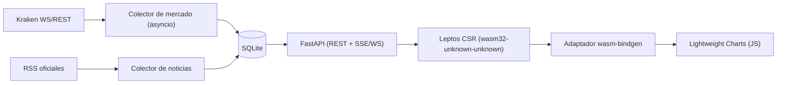

# Balancita — reescritura desde cero (FastAPI + Rust/WASM)

> **Estado: superseded.** Este documento fue reemplazado por
> [`docs/balancita-main-screen-roadmap.md`](balancita-main-screen-roadmap.md).
> Se conserva únicamente como análisis histórico y no debe guiar la
> implementación.

## 1. Veredicto

No recomendado como primer camino. Es técnicamente viable y produce una base
más "nativa" en Python/Rust, pero implica reconstruir ~24.000 líneas de
producto ya probadas (ver §5) y absorber una curva de aprendizaje de Rust.
Usar esta ruta sólo si el objetivo explícito es cambiar de stack por motivos
ajenos a Balancita (por ejemplo, estandarizar el ecosistema de la empresa en
Python/Rust). Para llegar más rápido a la misma experiencia de producto, ver
[`docs/balancita-current-stack-evolution.md`](balancita-current-stack-evolution.md).

## 2. Supuestos explícitos

- Un ingeniero senior full-time, sin otras asignaciones concurrentes.
- Sin experiencia previa productiva en Rust (contingencia de aprendizaje
  incluida en §4); experiencia sólida en Python y TypeScript.
- Kraken se mantiene como venue de mercado público (no hay reversión a
  Binance); sin API key para datos de mercado públicos.
- No se permiten órdenes reales, depósitos, retiros, custodia ni integración
  de broker. El control automático puede emitir señales y simulación sombra
  aisladas, nunca mutar el ledger de paper trading principal ni autorizar una
  orden.
- Se reutiliza Lightweight Charts vía un adaptador JS estrecho con
  `wasm-bindgen`; no se escribe un motor de gráficos propio.
- Estimaciones = rangos de planificación, no compromisos de fecha.

## 3. Qué se preserva de `doc/idea-balancita.md`

- Cabina de escritorio en una sola pantalla: marca "Balancita" arriba a la
  izquierda, EUR disponible arriba a la derecha, gráfico BTC-EUR 1m grande a
  la izquierda, noticias con proveniencia (`provenance`) a la derecha, controles
  Comprar/Vender abajo más un control de señales automáticas, resumen del
  instrumento.
- Tiempo de evento/recepción/visualización medibles, frescura expuesta, velas
  cerradas (no-look-ahead), pronósticos y resultados inmutables, y
  proveniencia de noticias — contratos ya definidos en
  [`docs/bitcoin-market-intelligence-roadmap.md`](bitcoin-market-intelligence-roadmap.md).
- Kraken como fuente de mercado pública coherente (reemplaza la mención a
  Binance del wireframe original).

## 4. Costo estimado (rangos)

| Hito                                                | Horas         | Semanas calendario (1 FTE) |
| --------------------------------------------------- | ------------- | -------------------------- |
| MVP wireframe (layout + velas 1m + paper simple)    | 140–200 h     | 3.5–5 semanas              |
| Paridad completa (noticias, pronósticos, SSE, obs.) | 360–520 h     | 9–13 semanas               |
| Contingencia de aprendizaje Rust (Leptos + WASM)    | +60–120 h     | +1.5–3 semanas             |
| **Total realista**                                  | **560–840 h** | **14–21 semanas**          |

Costo operativo adicional: sin costo de nube obligatorio (local-first);
tiempo de CI/build más largo por la compilación de Rust a `wasm32-unknown-unknown`
y `cargo`/`trunk` en cada iteración de frontend.

## 5. Qué se reescribe (métricas actuales aproximadas)

| Superficie                     | Métrica actual          |
| ------------------------------ | ----------------------- |
| Código de producto frontend    | ≈ 9.834 líneas (TS/TSX) |
| Código de producto de servidor | ≈ 14.129 líneas (TS)    |
| Invocaciones de test           | ≈ 653                   |

Toda esta superficie (dominio, proveedores, UI, servidor de inteligencia,
SQLite, SSE) se reconstruye desde cero en Python/FastAPI y Rust/Leptos; nada
del código actual se traspasa directamente.

## 6. Arquitectura objetivo



## 7. Estructura de proyecto recomendada

```
balancita-rewrite/
  server/                 # FastAPI, Python 3.12+
    app/
      main.py
      api/                # routers REST + SSE/WS
      domain/              # Money, Candle, Order, Forecast (Pydantic/dataclasses)
      collectors/          # Kraken, RSS
      store/                # SQLite (sqlite3/SQLAlchemy Core)
    tests/                  # pytest + httpx + TestClient
    pyproject.toml
  web/                    # Leptos CSR
    src/
      app.rs
      components/
      js_interop/           # wasm-bindgen -> Lightweight Charts
    Trunk.toml
    Cargo.toml
```

## 8. Contratos y elección de stream

- API/Contratos: JSON Schema generado por FastAPI/Pydantic (OpenAPI nativo).
- Streaming servidor→cliente: **SSE** (misma decisión que el servidor actual;
  ver §9 de la hoja de ruta de inteligencia) — más simple que WebSocket para
  push unidireccional y ya validado en el stack actual.
- WebSocket sólo si se requiere push bidireccional futuro (no en el MVP).
- Gráfico: Lightweight Charts vía JS cargado por Trunk, controlado desde Rust
  con `wasm-bindgen` (llamadas `createChart`, `series.update`).

## 9. Fases ordenadas

| Fase | Resultado                                                                      | Tests                                  | Estimado |
| ---- | ------------------------------------------------------------------------------ | -------------------------------------- | -------- |
| 0    | Repo, `pyproject.toml`, `Cargo.toml`/`Trunk.toml`, CI                          | Smoke build ambos lados                | 16–24 h  |
| 1    | Dominio Python (Money decimal, Candle, Order) + pytest                         | Unit tests dominio                     | 40–60 h  |
| 2    | Colector Kraken con SQLite + reconexión                                        | Tests de gap/reconexión con fixtures   | 60–90 h  |
| 3    | Layout Leptos CSR + gráfico 1m vía adaptador wasm-bindgen                      | Tests de render + smoke visual manual  | 80–120 h |
| 4    | Paper trading (preview/confirm/idempotencia) en API                            | Tests de contrato + `TestClient`       | 70–100 h |
| 5    | Noticias con proveniencia + panel derecho                                      | Tests de dedup/proveniencia            | 50–70 h  |
| 6    | Pronósticos inmutables + control automático (señales/shadow, sin mutar ledger) | Tests de inmutabilidad y no-look-ahead | 80–110 h |
| 7    | SSE end-to-end + observabilidad + paridad final                                | Tests de reconexión SSE, accesibilidad | 60–90 h  |
| 8    | Migración y cutover (ver §10)                                                  | Checklist de aceptación (§12)          | 20–40 h  |

## 10. Estrategia de migración / cutover

1. Construir en un repositorio o worktree separado (`balancita-rewrite/`),
   nunca dentro de `src/`/`server/` actuales.
2. Ejecutar ambas aplicaciones en paralelo (puertos distintos) durante todo
   el desarrollo; la app actual sigue siendo la única en producción/uso diario.
3. Congelar una lista de paridad funcional derivada de
   [`docs/implementation-progress.md`](implementation-progress.md) (fases 1–H)
   y verificarla ítem por ítem contra la reescritura.
4. Sólo tras aceptación explícita del usuario sobre la paridad, promover la
   reescritura como app principal; **no borrar la app actual** hasta que la
   paridad esté aceptada y haya al menos un periodo de uso paralelo.
5. Mantener el `doc/` original como referencia inmutable durante todo el
   proceso; ningún archivo bajo `doc/**` se edita en ninguna fase.

## 11. Riesgos

| Riesgo                                                  | Mitigación                                                                                     |
| ------------------------------------------------------- | ---------------------------------------------------------------------------------------------- |
| Curva de aprendizaje Rust/Leptos subestimada            | Contingencia explícita en §4; spike de 1 semana antes de comprometer fechas                    |
| Adaptador wasm-bindgen para Lightweight Charts frágil   | Mantenerlo mínimo (crear/actualizar/destruir); no envolver toda la API JS                      |
| Duplicación de esfuerzo mientras ambas apps coexisten   | Congelar la app actual en modo mantenimiento durante la reescritura                            |
| Pérdida de comportamiento no documentado                | Usar `docs/implementation-progress.md` como fuente de paridad, no sólo `doc/idea-balancita.md` |
| Compilación WASM más lenta que Vite en iteración diaria | Medir tiempos reales en la fase 0 antes de comprometer el cronograma                           |

## 12. Checklist de aceptación

- [ ] Layout de una pantalla reproducido: marca, EUR disponible, gráfico 1m,
      noticias, Comprar/Vender + control automático, resumen del instrumento.
- [ ] Kraken como única fuente de mercado pública; sin API key requerida.
- [ ] Velas cerradas alimentan evidencia; ninguna vela provisional se acumula.
- [ ] Pronósticos y resultados inmutables, sin mirar hacia adelante.
- [ ] Noticias con proveniencia completa (fuente, URL, tiempos, licencia).
- [ ] Control automático no autoriza ni ejecuta ninguna orden real ni muta el
      ledger principal sin confirmación explícita.
- [ ] `pytest` y suite Rust/wasm en verde; `trunk build --release` genera
      `dist/` servible.
- [ ] App actual sigue intacta y operable durante todo el proceso.

## 13. Fuentes oficiales

- FastAPI: https://fastapi.tiangolo.com/
- Server-Sent Events en FastAPI: https://fastapi.tiangolo.com/tutorial/server-sent-events/
- WebSockets en FastAPI: https://fastapi.tiangolo.com/advanced/websockets/
- Testing en FastAPI (`TestClient`/httpx/pytest): https://fastapi.tiangolo.com/tutorial/testing/
- Leptos — primeros pasos (CSR, `wasm32-unknown-unknown`, Trunk): https://book.leptos.dev/getting_started/index.html
- Leptos — despliegue CSR (`trunk build --release` → `dist/`): https://book.leptos.dev/deployment/csr.html
