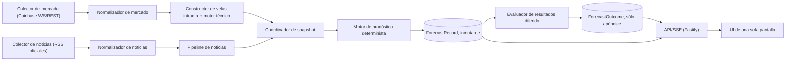

# Hoja de ruta de inteligencia de mercado BTC-EUR

> Referencia local para agentes y personas. No es la fuente de verdad del
> producto (`doc/personal-trading-app.md`, inmutable) ni el registro de
> implementación (`docs/implementation-progress.md`). Distingue dos
> orquestadores distintos: el skill de agente
> (`.github/skills/bitcoin-market-intelligence/SKILL.md`) gobierna cómo un
> agente futuro debe trabajar; este documento describe el orquestador en
> tiempo de ejecución que la aplicación todavía no tiene.

## 1. Veredicto

Construir un servidor local (Fastify + SQLite) que colecte mercado y noticias
de forma durable, calcule velas intradía e indicadores técnicos deterministas,
emita pronósticos inmutables con evidencia adjunta, evalúe resultados sin
mirar hacia adelante y publique todo por SSE a una única pantalla. El
navegador deja de ser la autoridad de datos; el servidor es el único reloj y
el único punto de persistencia. Ninguna fase habilita órdenes automáticas ni
dinero real.

## 2. Estado actual (tras la fase 9.3)

| Área                       | Estado observado                                                                 |
| -------------------------- | -------------------------------------------------------------------------------- |
| Pantalla                   | Dashboard único BTC-EUR (`BtcEurDashboard`), sin pestañas principales            |
| Cotización                 | Coinbase real, referencia compartida entre detalle y ticket de paper trading     |
| Velas históricas           | Sólo diarias (`granularity=86400`, máximo 300 por solicitud)                     |
| Análisis                   | Local continuo y determinista; Gemini permanece manual y opcional                |
| Noticias                   | Sin dominio ni proveedor implementado                                            |
| Persistencia en servidor   | No hay persistencia durable; la caché de Gemini es en memoria y expira           |
| Pronósticos                | No existe ledger de pronósticos ni evaluador de resultados                       |
| Streaming servidor-cliente | No existe canal propio (SSE/WebSocket); la UI sólo consume Coinbase directamente |

## 3. Definiciones de tiempo y frescura

| Término                 | Definición                                                                                        |
| ----------------------- | ------------------------------------------------------------------------------------------------- |
| Tiempo de evento        | Marca de tiempo que la fuente de origen asigna al hecho (trade, cierre de vela, publicación)      |
| Tiempo de recepción     | Marca de tiempo local cuando el colector del servidor recibe el mensaje                           |
| Tiempo de visualización | Marca de tiempo cuando el snapshot llega a la UI y se renderiza                                   |
| Frescura                | `tiempo de visualización − tiempo de evento`, medida por dato individual y expuesta en la UI      |
| Latencia p50            | Percentil 50 de `tiempo de recepción − tiempo de evento` sobre una ventana móvil                  |
| Latencia p95            | Percentil 95 de la misma distribución; usado para alertas y SLOs                                  |
| Tasa de datos obsoletos | Proporción de snapshots servidos cuya frescura supera el umbral configurado (por dato)            |
| Tasa de huecos          | Proporción de secuencias con saltos detectados sobre el total de mensajes esperados en la ventana |

Ningún componente puede describirse como "tiempo real" sin estas métricas
registradas y expuestas junto al dato.

## 4. Arquitectura objetivo

Fastify y SQLite son las decisiones iniciales; no se requieren Redis, Kafka,
microservicios ni infraestructura en la nube. El servidor corre localmente,
igual que el resto de la aplicación.

## 5. Por qué orquestación en servidor

| Razón                              | Detalle                                                                           |
| ---------------------------------- | --------------------------------------------------------------------------------- |
| Durabilidad                        | El navegador puede cerrarse; SQLite conserva pronósticos y evidencia              |
| Secretos, CORS y licencias         | Claves de Gemini y límites de licencia de datos de mercado sólo viven en servidor |
| Un solo reloj y una sola autoridad | Un proceso decide "ahora"; evita relojes de cliente divergentes                   |
| Historia reproducible              | El ledger append-only permite reconstruir qué se sabía en cada instante           |

Esto no contradice el principio local-first: el servidor corre en la máquina
del usuario, sin nube ni costo fijo adicional.

## 6. Fundamento de análisis técnico

| Categoría                    | Indicadores/técnica                           | Uso                                           | Advertencia                                                    |
| ---------------------------- | --------------------------------------------- | --------------------------------------------- | -------------------------------------------------------------- |
| Vela cerrada vs. provisional | Última vela en curso vs. velas finalizadas    | Sólo velas cerradas alimentan evidencia       | La provisional se muestra pero se reemplaza, nunca se acumula  |
| Estructura de mercado        | Higher-highs/higher-lows, soporte/resistencia | Identificar dirección estructural             | Requiere confirmación multi-timeframe                          |
| Tendencia                    | SMA, EMA y pendiente                          | Dirección y velocidad del movimiento          | Indicador rezagado por construcción                            |
| Momentum                     | RSI, MACD                                     | Fuerza y agotamiento del movimiento           | Puede divergir del precio sin invalidar la tendencia           |
| Volatilidad                  | ATR, ancho de bandas de Bollinger             | Dimensionar rangos y confianza del pronóstico | No predice dirección                                           |
| Volumen/VWAP                 | Cuando la fuente sea confiable                | Confirmar convicción del movimiento           | El spot de Coinbase no siempre refleja volumen agregado global |
| Confirmación multi-timeframe | Mismo conjunto en 15m/1h/4h                   | Reducir señales contradictorias               | Aumenta la latencia de la decisión final                       |

Cada indicador es una medición rezagada, no una verdad. Evitar apilar señales
redundantes; versionar explícitamente cada regla y cada conjunto de
parámetros (`ruleVersion`, `paramSetVersion`).

## 7. Horizontes y etiquetas de resultado

| Horizonte | Uso recomendado                          | Nota                                                        |
| --------- | ---------------------------------------- | ----------------------------------------------------------- |
| 15m       | Movimiento intradía inmediato            | Sensible a ruido; requiere banda neutral relativa más ancha |
| 1h        | Confirmación de tendencia de corto plazo | Balance razonable entre señal y ruido                       |
| 4h        | Contexto de sesión                       | Menor frecuencia de evaluación                              |
| 24h       | Comparación contra el baseline diario    | Se alinea con la vela diaria ya disponible                  |

Estos horizontes son valores por defecto recomendados, no una decisión de
producto irreversible. La etiqueta de resultado (`up`/`down`/`flat`) se
calcula sobre el retorno neto entre el precio de referencia y el precio
observado al cierre del horizonte, descontando comisión y deslizamiento
estimados, y comparando ese retorno contra una banda neutral configurable
(por ejemplo, ±0,15%). Un retorno dentro de la banda se etiqueta `flat`.

## 8. Esquema `ForecastRecord`

| Campo                              | Descripción                                                                  |
| ---------------------------------- | ---------------------------------------------------------------------------- |
| `id` / `version`                   | Identificador inmutable; una nueva versión nunca sobrescribe una anterior    |
| `instrumentId`                     | `BTC-EUR` para la primera cobertura                                          |
| `createdAt`                        | Tiempo de creación del registro en el servidor                               |
| `asOfTimestamp` / `eventCutoff`    | Corte de evidencia: nada posterior a este instante puede usarse como entrada |
| `horizon`                          | `15m` \| `1h` \| `4h` \| `24h`                                               |
| `referencePrice`                   | Precio base contra el que se mide el resultado                               |
| `probabilityUp/Down/Flat`          | Probabilidades que deben sumar 1                                             |
| `expectedRange` / `expectedReturn` | Opcionales; rango o retorno esperado                                         |
| `technicalFeatureSnapshot`         | Valores de indicadores usados, con su versión (`technicalFeatureVersion`)    |
| `newsEvidenceIds/Versions`         | Referencias a evidencia de noticias usada, versionadas                       |
| `dataFreshness` / `dataGaps`       | Métricas de frescura y huecos vigentes al momento del corte                  |
| `modelVersion` / `ruleVersion`     | Versión del motor y de las reglas aplicadas                                  |
| `abstained` / `abstentionReason`   | El motor puede abstenerse; la razón queda registrada                         |
| `contentHash`                      | Hash del contenido del registro para auditoría e integridad                  |

El resultado no es un campo mutable del pronóstico. Al vencer el horizonte,
el evaluador inserta un `ForecastOutcome` separado con `forecastId`,
`evaluatedAt`, precio y etiqueta observados, métricas calculadas y su propio
`contentHash`. Las vistas unen ambos registros sin reescribir la evidencia
original.

## 9. Evaluación honesta

Forward-testing primero: reconstruir con precisión el tiempo exacto en que
una noticia estuvo disponible es difícil, así que la validación histórica
completa se pospone. Reglas obligatorias: sólo walk-forward (nunca partición
aleatoria de entrenamiento/prueba en series temporales), ninguna vela abierta
como evidencia de un pronóstico aún vigente, y ninguna noticia con
`ingestedAt` posterior al `asOfTimestamp` del pronóstico que la usa.

| Métrica                                | Rol                                                                               |
| -------------------------------------- | --------------------------------------------------------------------------------- |
| Cobertura / abstención                 | Proporción de pronósticos emitidos vs. abstenidos; abstenerse es válido y se mide |
| Precisión direccional                  | Secundaria; nunca la métrica principal de optimización                            |
| Brier score                            | Métrica principal de calidad probabilística                                       |
| Calibración por bandas de probabilidad | Verifica que un "70% arriba" ocurra aproximadamente el 70% de las veces           |
| Log loss                               | Opcional, métrica adicional de calibración                                        |
| MAE de retorno/rango                   | Error absoluto medio cuando se estima retorno o rango                             |
| Cobertura de intervalo                 | Proporción de veces que el resultado real cae dentro del rango estimado           |
| Desempeño por horizonte y régimen      | Segmentado por horizonte y por volatilidad alta/baja                              |
| Comparación contra baselines           | "Sin cambio" y "momentum simple"; ningún pronóstico se acepta sin superarlos      |

No se optimiza para rentabilidad como primer criterio.

## 10. Modelo de confianza de noticias

| Nivel                   | Ejemplos                                  | Tratamiento                                                                          |
| ----------------------- | ----------------------------------------- | ------------------------------------------------------------------------------------ |
| Oficial/primario        | SEC, BCE, Reserva Federal (RSS oficiales) | Autoritativo; puede usarse como evidencia principal                                  |
| Reportería con licencia | Medios con licencia verificada            | Requiere provenance completa; sólo fragmentos permitidos, nunca el artículo completo |
| No verificado/social    | Redes sociales, foros                     | Excluido de señales de pronóstico en esta primera etapa                              |

Cada elemento de noticia conserva: `source`, `url`, `publishedAt`,
`ingestedAt`, `retrievedAt`, `contentHash`, `licenseStatus` y
`correctionStatus`. El pipeline aplica deduplicación y canonicalización,
filtra por relevancia a BTC-EUR, clasifica con una taxonomía de eventos y
adjunta sentimiento/impacto/confianza/horizonte con cita a la fuente. El
filtrado determinista ocurre antes que cualquier paso opcional con Gemini;
Gemini no puede inventar hechos y permanece manual y opt-in, salvo
autorización separada.

## 11. Fases de implementación

| Fase | Objetivo                                     | Entregables clave                                                                     | Pruebas                                                    | Puerta de salida                                                        |
| ---- | -------------------------------------------- | ------------------------------------------------------------------------------------- | ---------------------------------------------------------- | ----------------------------------------------------------------------- |
| A    | Contratos + SLIs + política de fuentes       | Tipos de colector/normalizador/`ForecastRecord`, fórmulas de SLI, política de fuentes | Tests de contrato y fixtures de esquema                    | Contratos compilan; SLIs y política documentados y revisados            |
| B    | Ingesta de mercado durable                   | Colector Coinbase con SQLite, reconexión, control de secuencia y gaps                 | Tests de reconexión/gap/idempotencia con fixtures grabadas | Datos sobreviven un reinicio del servidor; tasa de huecos medida        |
| C    | Velas intradía + motor técnico               | Constructor de velas 1m/5m/15m/1h; indicadores versionados con warm-up                | Tests de límites de vela, warm-up, reemplazo provisional   | Indicadores reproducibles sobre fixtures grabadas                       |
| D    | Pronósticos inmutables + scorer diferido     | Ledger append-only, motor de reglas determinista, evaluación diferida                 | Tests de inmutabilidad y no-look-ahead                     | El pronóstico nunca se sobrescribe; el resultado se anexa después       |
| E    | Ingesta de noticias confiable                | Colectores RSS oficiales, normalización, provenance completa                          | Tests de dedup, corrección, provenance faltante rechazada  | Sólo se almacena noticia con provenance completa                        |
| F    | Análisis determinista, luego Gemini opcional | Reglas de relevancia/taxonomía; integración opcional con Gemini existente             | Tests de filtrado determinista y de fallback sin Gemini    | El camino determinista funciona sin Gemini; Gemini nunca inventa hechos |
| G    | Comparación técnica vs. noticias             | Puntuaciones separadas por fuente; combinación diferida                               | Tests de scoring separado y backtests comparativos         | Evidencia documentada de valor incremental antes de combinar señales    |
| H    | UI de una pantalla + observabilidad          | Endpoint SSE, panel de SLIs, indicadores de frescura/stale/gap                        | Tests de reconexión SSE y accesibilidad                    | La UI refleja frescura y estado sin prometer "tiempo real"              |
| I    | Validación en sombra / go-no-go              | Periodo de shadow (por ejemplo, 30 días), reporte comparativo                         | Tests de agregación de métricas de shadow                  | Decisión go/no-go documentada con evidencia                             |

El paper trading permanece aislado en todas las fases; ninguna habilita
órdenes automáticas.

## 12. Estrategia de pruebas

Reloj inyectable en todos los componentes con tiempo; fixtures grabadas para
mercado y noticias; pruebas de reconexión, huecos, replay e idempotencia;
límites exactos de vela y warm-up/reemplazo de la vela provisional;
deduplicación, corrección y provenance de noticias; inmutabilidad de
pronósticos y scoring diferido; guardas explícitas contra fugas de
información futura; fixtures deterministas para calibración; reconexión de
SSE; accesibilidad de la UI. Ninguna prueba realiza llamadas de red reales.

## 13. Recomendaciones, riesgos y próximo paso

Comenzar por las fases A y B. Usar SQLite desde el inicio porque la
auditoría y el historial durable ya son una necesidad comprobada. Usar SSE
para la actualización unidireccional de la UI. Exigir un periodo de sombra de
30 días antes de confiar en cualquier comparación entre señales técnicas y de
noticias.

| Riesgo                                                      | Mitigación                                                               |
| ----------------------------------------------------------- | ------------------------------------------------------------------------ |
| Los términos de datos de Coinbase restringen redistribución | Uso local/interno; revisar términos antes de exponer a usuarios externos |
| Errores de sincronización temporal invalidan backtests      | Walk-forward estricto; `ingestedAt <= asOfTimestamp` obligatorio         |
| Sobreajuste al combinar señales técnicas y de noticias      | Separar puntuaciones primero; exigir evidencia antes de combinar         |
| La fuente CFTC no pudo verificarse en esta consulta         | Revalidar el acceso más adelante; no asumir disponibilidad ni ausencia   |

| Decisión pendiente                                           | Estado                                                       |
| ------------------------------------------------------------ | ------------------------------------------------------------ |
| Ubicación, retención y copia de seguridad del archivo SQLite | Pendiente; resolver en la fase A                             |
| Umbral exacto de la banda neutral por horizonte              | Pendiente; calibrar con datos reales en la fase D            |
| Fuentes de noticias adicionales tras validar SEC/BCE/Fed     | Pendiente; revalidar CFTC y explorar otras fuentes oficiales |
| Duración exacta del periodo de sombra (30 días propuestos)   | Propuesto; confirmar antes de la fase I                      |

Próximo paso: cerrar BI-3 (validación e indexación) y, sólo tras autorización
explícita, iniciar la fase A con TDD estricto.

## 14. No objetivos

| No objetivo                                        | Motivo                                                     |
| -------------------------------------------------- | ---------------------------------------------------------- |
| Garantías de precio                                | Los pronósticos son probabilísticos, nunca promesas        |
| Órdenes automáticas                                | El análisis nunca ejecuta ni autoriza operaciones          |
| Integración con dinero real                        | Fuera de alcance de esta hoja de ruta                      |
| Scraping sin permiso                               | Sólo fuentes oficiales o licenciadas con permiso explícito |
| Almacenamiento de artículos completos sin licencia | Sólo fragmentos permitidos y con provenance                |
| Afirmar causalidad a partir de correlación         | Las métricas miden asociación, nunca causa                 |

## 15. Fuentes verificadas (2026-09-21)

- Canales del WebSocket de Coinbase Exchange:
  https://docs.cdp.coinbase.com/exchange/websocket-feed/channels
- Resumen del feed WebSocket de Coinbase Exchange:
  https://docs.cdp.coinbase.com/exchange/websocket-feed/overview
- Límites de la REST API de Coinbase Exchange:
  https://docs.cdp.coinbase.com/exchange/rest-api/rate-limits
- Feeds RSS oficiales de la SEC: https://www.sec.gov/about/rss-feeds
- Feed de prensa del BCE: https://www.ecb.europa.eu/rss/press.html
- Feed de prensa de la Reserva Federal:
  https://www.federalreserve.gov/feeds/press_all.xml
- Documentación oficial de `trading-signals`:
  https://github.com/bennycode/trading-signals

Nota sobre Coinbase: el feed público puede emitir actualizaciones de ticker
sólo cuando ocurren matches, con heartbeat hasta cada segundo; los mensajes y
matches pueden perderse, por lo que la observación de secuencia y la
recuperación de huecos son obligatorias, no opcionales.

Nota sobre RSS oficiales: SEC, BCE y Reserva Federal exponen enlaces y
marcas de tiempo de publicación verificables, pero son autoritativos e
incompletos para Bitcoin específicamente; no cubren el universo completo de
noticias relevantes. La página de la CFTC intentada no fue accesible para
esta consulta y debe revalidarse más adelante; esto no implica que la fuente
esté permanentemente no disponible.

Nota sobre `trading-signals`: la librería ofrece indicadores TypeScript
orientados a streaming, con modo de reemplazo para la vela en curso y
soporte de warm-up/estado listo para SMA, EMA, RSI, MACD y ATR. Se recomienda
un spike acotado para evaluarla; su adopción no está decidida.
